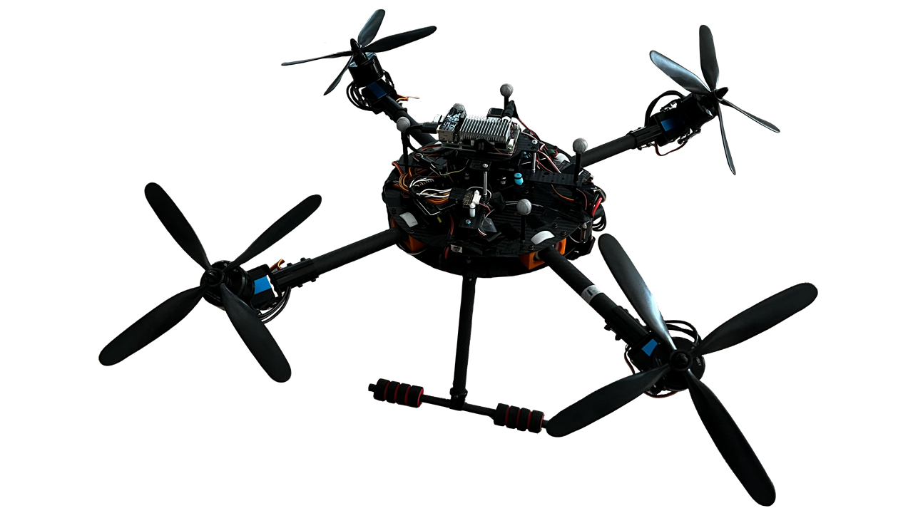

# Quad3DV
 Quad3DV is a overactuated multirotor actuated by four rotors with two tilt directions.
 
 
 
)
## 1 Videos of the real experiments given in the papar:

A New Overactuated Multirotor: Prototype Design, Dynamics Modeling, and Control

https://user-images.githubusercontent.com/14845756/172319733-a3100317-61e8-4f30-a988-6b91e9fb6e91.mp4

## 2 Simulations:

### attitude tracking：

### position tracking：

## 3 More real experiments：

### attitude tracking random signals from RC (Video is played at double speed): 

https://user-images.githubusercontent.com/14845756/173357097-2bccb6cf-85f8-4454-b5a3-ab17533d2188.mov

 

